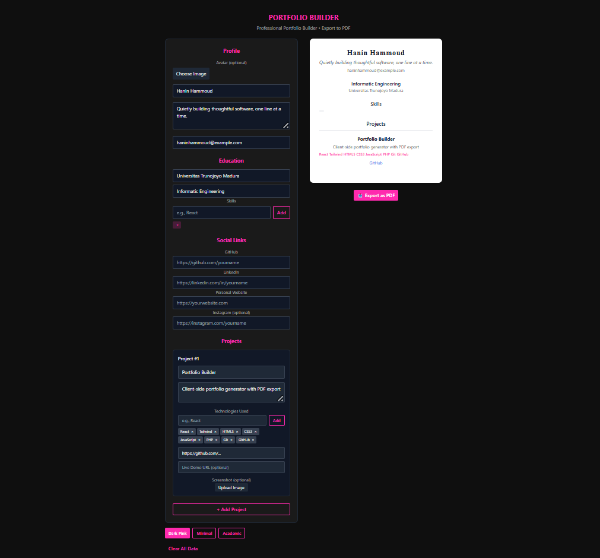

# 🔗 PortoLab

> **Build. Preview. Export.**  
> Sebuah portfolio builder client-side yang aku kembangkan saat belajar React — untuk latihan dan portofolio pribadi.



PortoLab dibuat karena aku ingin punya alat sederhana untuk:

- Mengisi data profil secara interaktif
- Melihat preview langsung
- Ekspor ke PDF yang rapi  
...semua **tanpa backend**, hanya pakai React, Tailwind CSS, dan `html2pdf.js`.

---

## Features

- 3 template: **Dark Pink** (aesthetic), **Minimal** (developer), **Academic** (formal)  
- Ekspor ke **PDF siap cetak**  
- Data otomatis tersimpan di browser  
- Animasi berirama (pakai Framer Motion)  
- Upload avatar & screenshot proyek  
- Dukungan GitHub, LinkedIn, website

---

> _“Quietly building thoughtful software, one line at a time.”_

---

## How To Run

```bash
git clone https://github.com/haninhammoud01/PortoLab.git
cd PortoLab
npm install
npm run dev
